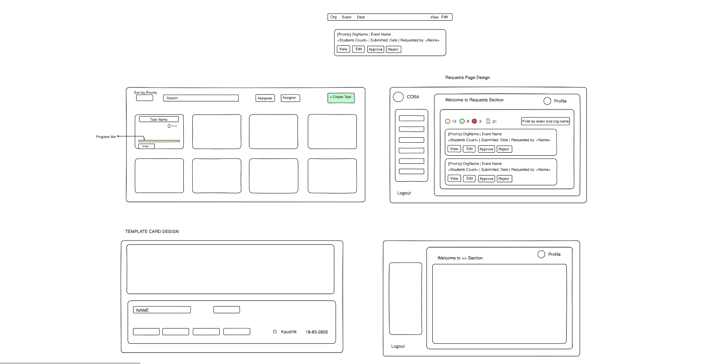
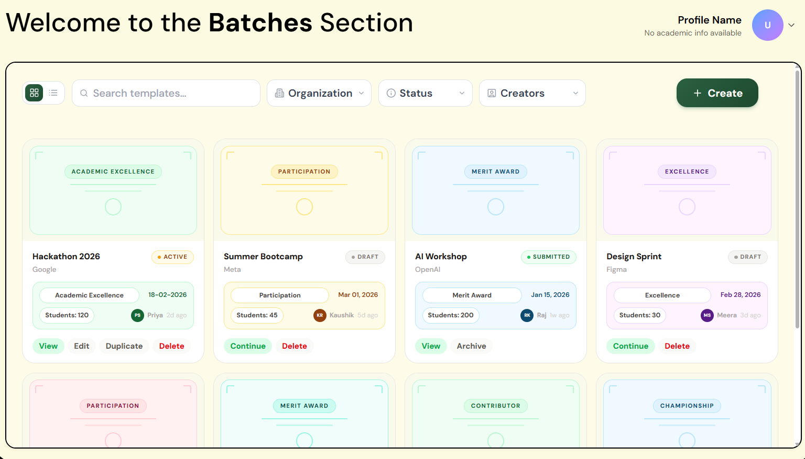
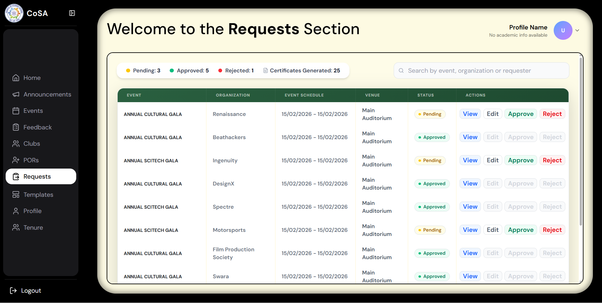
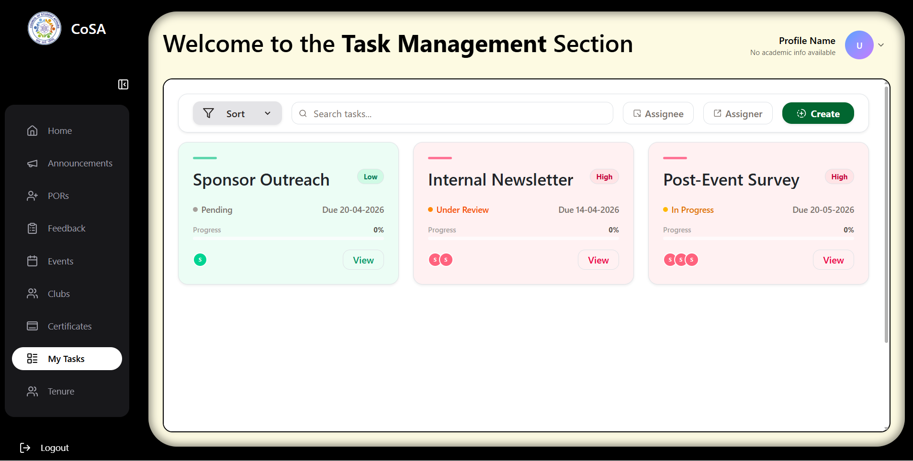

# Building for COSA — My FOSS Overflow Journey  

*FOSS Overflow 2026 — Kaushik | Student_Database_COSA*

---

## The Project

COSA — Council of Student Affairs at IIT Bhilai — handles a wide range of operations: clubs, events, positions, certificates, and internal workflows. Student Database COSA is the open-source platform built to manage all of this in one place.

When I joined, the project had a solid base, but it was missing some key systems that actually matter in day-to-day usage — a more reliable authentication flow, a proper way to issue certificates, and a structured system to assign and track tasks.

That’s where I contributed.

---

## What I Built

### Strengthening the Foundation (Auth & Structure)

Before building new features, I focused on improving and stabilizing the existing authentication system.

The project used `passport-local-mongoose`, which worked but hid too much logic behind abstractions. Instead of replacing it, I refactored the auth layer to make it more explicit, reliable, and easier to work with.

Key improvements:
- Fixed issues in the existing authentication flow  
- Made authentication more robust and predictable  
- Implemented the **registration UI** and connected it end-to-end with the existing API  
- Improved the overall UI/UX of auth-related screens   
- Set up a persistent session store using `connect-mongo` so sessions survive across server restarts  
- Used Zod across all APIs I worked on by defining custom schemas to validate request bodies  

I also refactored the database structure by splitting a large monolithic schema file into separate model files, making the codebase easier to maintain and extend.

---

### Certificate Management System

There was no proper system for issuing certificates — something clubs rely on heavily.

I built a complete certificate workflow:

- Coordinators can create certificate batches linked to events and templates  
- Batches go through an approval chain (GenSec → President)  
- Admins get a Requests page to review, approve, or reject batches  
- Students can view and download certificates once approved  

To make the system more practical, I also integrated email notifications using `nodemailer`:
- Emails are sent when a batch is **created**, **approved**, or **rejected**  
- All relevant stakeholders are notified automatically  

#### Screens

  
  

---

### Task Assignment System

Another major gap was the lack of structured task delegation within clubs.
I implemented a task system that reflects the actual hierarchy:

- Presidents can assign tasks across the council  
- GenSecs can assign within their units  
- Coordinators can assign within their clubs  

These constraints are enforced by the system, preventing invalid assignments.

Tasks follow a clear lifecycle:
- Pending → In Progress → Submitted → Completed  

The review step:
- The assignee submits their work  
- The assigner reviews it before marking it as completed  

#### Screens

   
---

## What I Took Away

This project shifted how I approach building software.

I started out focused on adding features, but working on a shared codebase made me think more about stability, edge cases, and long-term maintainability.

- I learned to read existing code carefully before making changes  
- I became more mindful of how small changes can affect larger systems  
- Feedback from tools and mentors helped catch issues I initially overlooked  

The process wasn’t always smooth — scope grew, PRs became larger than expected, and reviews took time. But that’s part of building real systems used by real people.

And that’s what made the experience valuable.

---

*Written as part of FOSS Overflow 2026 | OpenLake, IIT Bhilai*