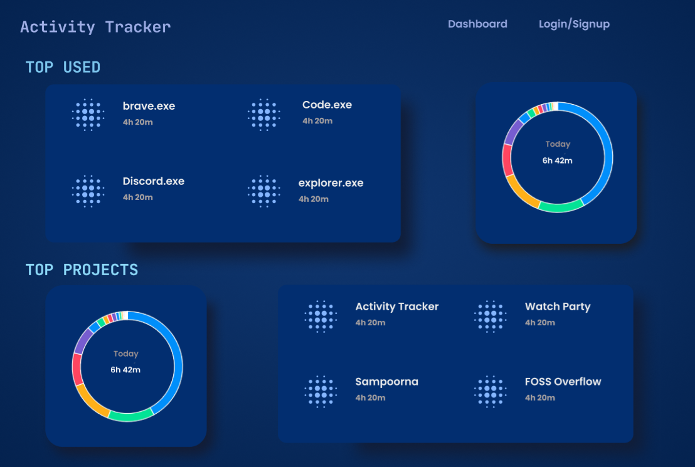

# Learning With Practise

Learning new things with hands-on experience is an excellent way of acquiring a new skill. It is not only a faster and more effective method but also you get to tackle errors which you will face in real-life projects, so you will be ready to deal with those.

*"Through practice, gently and gradually we can collect ourselves and learn how to be more fully with what we do. – Jack Kornfield"*

 ---
  
[**FOSS Overflow**](https://fossoverflow.dev/) is a month-long event celebrating open-source culture and is organized by Google Developer Student Clubs and OpenLake at IIT Bhilai. The program is designed to prepare students for global open-source internships like GSoC, LFX, and Outreachy. Foss Overflow gave me a great opportunity to learn something new while working on a project.
 

  

  

 
I wanted a project which had a tech stack I am comfortable in as well as contain something new to learn,

so I applied for building a [VS Code Extension](https://github.com/OpenLake/Activity-Tracker/tree/main/packages/vscode-extension) as it was based on the MERN stack (on which I have worked before) also it gave me a good chance to learn how can we create our extensions in vs code.

In today's competitive world everyone wants to be productive in day-to-day life. For that one of the key things is time management and organizing the tasks, especially the programmers like me who want to contribute to different projects. For them, it is important to see which projects they are spending more time on and which they are lacking to give time to give all the projects the time which it requires and also prioritize them. The VS Code Extension which I build tracks the time that the user spends on various projects in the vs code editor. The Extension graphically shows the data about the projects which makes it easier to interpret the data.

The extension not only stores the time spent but also gets the data about the time spent in writing codes in different languages. So that the user can see which language they use the most and in which they are more efficient.

This Extension is a subset of the activity tracker application which tracks time spent in various applications not only vs code. It is a full-stack application that allowed me to learn and understand the various aspects of developing a full-stack application. Now I am more confident in developing a scalable full-stack application while maintaining a clean and organized code.

During this project I also got to learn Figma for UI design. My first design for the front-end of Activity Tracker is as follows:- 

The event allowed me to meet new people and together fix errors in code, design UI, etc. Overall a good experience sharing knowledge.

  
Special thanks to my mentors [Ambar Mutha](https://github.com/supercoww), [Kumar Shivendu](https://github.com/KShivendu), and Shikhar Vashistha who were there to help me with my doubts and clear the errors in code making it more clean and efficient.

I am [Aayush Deshmukh](https://github.com/Aayushd18, a third-year student at IIT Bhilai. I love contributing to open-source projects. I congratulate FOSS Overflow for its inaugural event and I hope that it grows bigger.